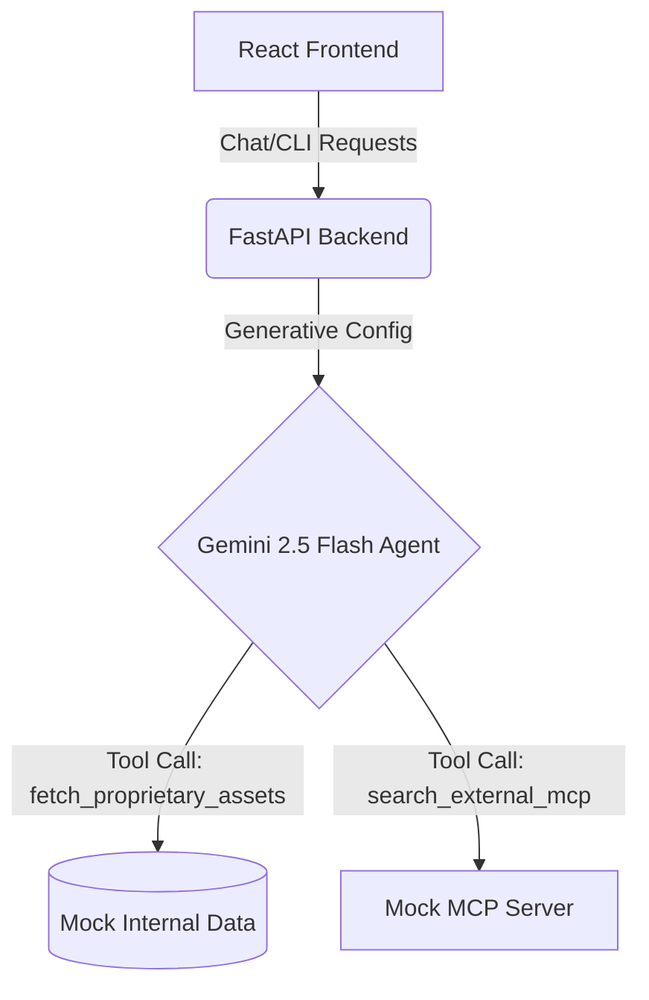

# 🤖 Onboarding Agent Buddy

 An intelligent, autonomous onboarding assistant designed to streamline the experience for new hires using the power of Google Gemini 2.5 Flash.

## 🎯 Problem Statement
When new employees join a company, they are often overwhelmed by scattered documentation, complex IT setup procedures, and disjointed HR portals. Finding simple answers (like "How do I set up my VPN?" or "Which boilerplate should I use?") usually requires interrupting busy colleagues or navigating clunky intranet search engines.

## 💡 Solution
The **Onboarding Agent Buddy** acts as a virtual HR representative and technical guide for new hires. It connects directly to secure internal company documentation and uses AI reasoning to answer policy questions, guide setup processes, and provide a fun, interactive "hacker" CLI terminal for developers. By using an intelligent agent, we turn static, hard-to-find documents into a conversational, instantly accessible assistant.

## 🌟 Overview

The **Onboarding Agent Buddy** acts as a virtual HR representative and technical guide for new employees. It connects to secure internal company documentation and uses AI reasoning to answer policy questions, guide setup processes, and provide a fun, interactive "hacker" CLI terminal for developers.

### ✨ Key Features

- **Dual Interface Design:** 
  - 💬 **Conversational Chat UI:** A modern, elegant dark-themed chat interface for casual inquiries and guidance.
  - 💻 **Developer CLI Terminal:** A raw, monospace terminal mimicking internal sysadmin tools with real commands.
- **RAG-Powered Knowledge Base:** Dynamically parses local mock company data (employee handbooks, technical setup guides, and office rules) so the agent can answer highly specific company questions.
- **Tool Triggers & Reasoning Loop:** Uses Gemini Function Calling to transparently trigger RAG document searches or escalate complex/sensitive questions directly to human HR.
- **Mock MCP Connectors:** Includes mocked architecture for the Model Context Protocol (MCP) to simulate enterprise integrations (e.g., HR APIs, remote directory lookups).

---

## 🏗️ Architecture

The application is built using a modern, decoupled architecture:
1. **Frontend Interface:** A React application providing both a conversational UI for general employees and a CLI Terminal for engineers.
2. **Agent Backend:** A FastAPI Python server hosting the Gemini 2.5 Flash agent.
3. **Agent Skills (Tools):** 
   - **Internal RAG Search:** Python tools (`company_search.py`) that parse local JSON/Markdown mock datasets (engineering assets, design resources, HR compliance).
   - **Mock MCP Server Integration:** A mocked endpoint (`/api/external-sources`) simulating a Model Context Protocol (MCP) server for secure, remote enterprise directory lookups.
4. **Security:** API keys are strictly managed via local `.env` files (ignored by Git) and not hardcoded into the application.



---

## 🛠️ Tech Stack

- **Frontend:** React (TypeScript), Vite, Vanilla CSS
- **Backend:** Python, FastAPI, Uvicorn
- **AI Agent Engine:** Google GenAI SDK (`gemini-2.5-flash`)
- **Data:** Local Markdown & Text files (RAG Simulation)

---

## 🚀 Getting Started

### Prerequisites
- Node.js & npm (for the frontend)
- Python 3.9+ (for the backend)
- A Google Gemini API Key

### 1. Clone the repository
```bash
git clone https://github.com/shlokapulipati/Onboarding-Buddy.git
cd Onboarding-Buddy
```

### 2. Environment Setup
Create a `.env` file in the root of the project and add your Gemini API key:
```env
GEMINI_API_KEY="your_api_key_here"
```

### 3. Start the FastAPI Backend
Open a terminal in the root directory and install requirements (if you have a requirements.txt) or just run the server:
```bash
pip install fastapi uvicorn google-genai
python -m uvicorn api:app --reload --port 8000
```
*The backend will now be running on http://localhost:8000*

### 4. Start the React Frontend
Open a **new** terminal, navigate to the `frontend` folder, and start Vite:
```bash
cd frontend
npm install
npm run dev
```
*The UI will launch on http://localhost:5173*

---

## 💻 CLI Terminal Commands

Once logged in to the Developer CLI in the app, you can test these built-in agent endpoints:
- `help` - Display the helper blueprint.
- `files` - Connect to the File Manager to list company guidelines.
- `cat <filename>` - View specific file contents directly in the terminal.
- `search <policy>` - Trigger a local RAG lookup on all documents.
- `external` - Connect to mocked external MCP sources.
- `clear` - Clear terminal logs.

---
## 📂 Project Structure

```
Onboarding-Buddy/
├── api.py                      # FastAPI server & Gemini configuration
├── mock-company-data/          # Local RAG knowledge base (handbooks, rules)
├── skills_dir/                 # Python agent skills (company_search.py)
├── frontend/                   # React Vite application
│   ├── src/
│   │   ├── App.tsx             # Main dual-UI component (Chat & CLI)
│   │   └── index.css           # Vanilla CSS styling
│   └── package.json            
└── .env                        # Secure environment variables (ignored by Git)
```

## 📝 License
This project is built for educational and internal onboarding simulation purposes.
